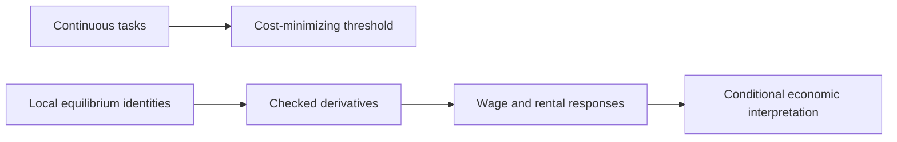

[](presentation.pdf)
[](lean/verification/build.json)
[](lean/docs/SCOPE_AND_COST.md)

# A guide to the paper, the checks, and the evidence

This repository studies **The Race Between Machine and Man** by Daron Acemoglu and Pascual Restrepo, using the **June 2017 revision of NBER Working Paper 22252**. It combines a presentation, a handwritten derivation, a small numerical check, and an expanded Lean development using **AppliedModelingLib**, the package required for the homework.

The central question is whether new tasks can offset the displacement of workers by automation. The central lesson from our verification is equally important: a checked supporting proof does not establish the entire economic model.

## Start here: links and what they establish

**Latest contribution:** the formalization now follows continuous tasks through cost allocation and local factor-price responses. It derives response equations from locally valid equilibrium identities and a moving task integral. Full equilibrium existence and dynamic growth remain outside the checked scope.

| Link | What you will find | Verification result |
| --- | --- | --- |
| [Public repository](https://github.com/gsaco/ai-06-restrepo) | The published project on GitHub. | The address opens the correct public repository and matches the clickable link in the presentation title slide. It opens the default branch; use the branch link below for this revised package. |
| [Presentation PDF](presentation.pdf) | The 17-slide presentation, including the handwritten derivation on slide 15. | Compilation and visual inspection passed. See the remaining presentation refinements below. |
| [Presentation source](presentation.tex) | Editable LaTeX source for the PDF. | The source points to the existing handwritten image. |
| [Handwritten derivation](hand/derivation.png) | The original photograph of the wage decomposition worked out by hand. | The file is present and embedded in the presentation; the photo is no longer pending. |
| [Lean reading guide](lean/docs/LEAN_VERIFICATION.md) | Module-by-module claims, assumptions, library reuse, and reproduction instructions. | The expanded package has a dedicated compiler and recursive axiom check; its exact evidence is in the [build report](lean/verification/build.json). Source equivalence and full-paper coverage are separate, unfinished reviews. |
| [Scope and cost assessment](lean/docs/SCOPE_AND_COST.md) | All 19 named source results and the work remaining. | Explains why a stronger partial formalization is defensible and a nearly complete claim would be misleading. |
| [AppliedModelingLib](https://github.com/nikhgarg/AppliedModelingLib) | The homework library, previously called EconCSLib. | Used directly: the cost-threshold existence proof imports its continuous-threshold theorem. The checked revision and module hash are recorded in the build report. |
| [Numerical check](analysis/wage_cases.py) | Three illustrative wage-response calculations. | Running the script reproduces the negative, zero, and positive responses shown on slide 9. These are illustrative cases, not a calibration. |
| [Conversation record](prompts.md) | Actual exchanges from this conversation, with the edited derivation question explicitly labeled. | Historical messages retain their original wording; omissions and excerpts are identified. Earlier build results remain documented in the Lean working memo. |
| [Paper record at NBER](https://www.nber.org/papers/w22252) | The source paper's bibliographic record. | The June 2017 paper was checked using a local PDF. Automated direct access to NBER returned an access error, so live PDF availability is not certified here. |

**Branch for this revised package:** [View branch-1 on GitHub](https://github.com/gsaco/ai-06-restrepo/tree/branch-1). This branch contains the updated presentation, handwritten photograph, README, banner, and badges. The main repository link opens the default branch. Relative links in this README follow whichever branch you are viewing.

The banner and badges are stored locally in `assets/`. They are descriptive status labels, not live continuous-integration badges.

## What the paper asks

The paper studies the aggregate economy through the tasks needed to produce output. Automation allows capital to perform more existing tasks. The creation of new tasks introduces activities where workers have a comparative advantage. These forces jointly determine productivity, wages, employment, and the division of income between labor and capital.

Three decisions connect the model. Firms choose the cheapest feasible way to perform each task. Households choose consumption, work, and, in the dynamic model, saving. Scientists choose whether to develop automation or create new tasks according to the expected rewards.

## Main findings and their conditions

**Short run.** When capital is fixed and the technological limit on automation binds, additional automation reduces relative wages, employment, and labor's income share under the paper's static assumptions. These require labor productivity to increase across tasks, either a vanishing intermediate-input share or unit elasticity within tasks, and a capital stock low enough that new tasks are immediately worth adopting. The strict employment response also requires positive labor-supply elasticity. If firms already choose not to use all available automation, a small expansion in technical feasibility has no marginal effect. New tasks support labor under these same conditions.

**The wage level can move either way.** Automation raises productivity but also displaces labor. The wage rises when the productivity gain outweighs displacement, falls when displacement dominates, and has no marginal change when the effects balance. A fall in labor's income share therefore does not by itself establish a fall in the wage.

**Long run.** Capital accumulation changes the answer. Along the relevant interior balanced growth path, greater automation can raise the long-run wage while reducing employment and labor's income share. These conclusions use exponential task productivity, the paper's restrictions on production elasticities, and the existence conditions for the relevant growth path.

**Endogenous innovation.** The main balanced-growth result additionally requires the effective elasticity across tasks to exceed the elasticity within tasks and a sufficiently small supply of scientists. Below the critical discount rate, a full-automation growth path exists. Above it, the relative productivity of research determines whether there is a unique interior path, multiple paths, or a unique path without automation. In the unique interior case, the paper establishes global saddle-path stability when the household curvature parameter is zero, and local uniqueness and asymptotic saddle-path stability when it is positive. Equality boundaries are separate cases. Slides 11–12 present this classification.

## What was actually verified

### Hand calculation

The handwritten derivation solves two equilibrium relations from the paper's appendix to recover the wage decomposition. It confirms why a productivity improvement need not raise wages. It takes those equilibrium relations as inputs; it does not rederive the whole model.

The recorded AI answer already gave the conditional conclusion correctly. The hand calculation independently checks that answer; it is not evidence that the AI made the opposite claim.

### Numerical calculation

The script holds an illustrative displacement effect at twenty percent and varies the productivity gain. It reproduces wage responses of negative fifteen percent, zero, and positive fifteen percent. These are local response coefficients for an illustrative parameter choice, not predictions of realized wage changes.

### Lean verification and its boundary

The new development substantially extends the original two classroom examples. Its focus follows the homework priorities: the continuum of tasks, the automation threshold, displacement, and reinstatement.

| Layer | What Lean now proves | What the result still assumes |
| --- | --- | --- |
| Continuous tasks | Exact partition into capital and labor tasks, their lengths, and changes when the boundaries move | Admissible task boundaries; task counts are not employment |
| Firm allocation | Minimum primary-factor cost, unique interior cost threshold, and its implementation subject to technology | Positive prices, increasing productivity, and explicit continuity and price-crossing conditions for existence |
| Technology changes | Displacement and reinstatement in task measures; saturation when extra feasible automation goes unused | Comparisons of given boundaries and prices; full equilibrium feedback is separate |
| Local relative demand | Differentiation of the equilibrium identity and the actual integral over changing task boundaries | A differentiable equilibrium path satisfying the identity locally |
| Price index | Differentiation of the constant CES price index | Positive inputs and effective substitution elasticity different from one |
| Wage and rental responses | Unique solution of the response system; automation and new-task cases; positive, zero, and negative wage responses | Explicit coefficient restrictions for each sign conclusion |
| Labor share and employment | Endogenous labor-supply derivatives and sign relationships; a separate market-clearing bridge from price weights to income shares | Positive normalized wages and labor supply; strict employment signs need increasing labor supply |

**The main integrated result is `localFactorResponses`.** It combines the task-productivity integral, relative-demand differentiation, and price-index differentiation into wage and rental response formulas. This goes beyond defining a wage response and proving its sign: the differential relations are obtained by calculus from identities that hold near the comparison point.



The threshold and equilibrium-response developments are distinct proof components. The diagram does not claim that the former constructs the equilibrium path used by the latter.

**Why keep the status partial?** The assignment prioritizes selected parts of the paper, and these are now developed much further. Full coverage is also mathematically expensive: it needs continuum production and optimization, equilibrium existence, dynamic household decisions, balanced growth, stability, endogenous research, and the extensions. The [cost assessment](lean/docs/SCOPE_AND_COST.md) inventories the missing results. No complete named proposition is claimed as finished.

One interpretation gap particularly matters for the hand derivation: the checked price-index calculation supplies a dual productivity coefficient. Identifying it with the paper's primal productivity effect still requires a production-duality argument. Changes in the implemented task cutoff also need a regime argument before they become changes in the technological frontier. These are substantive proof boundaries.

### What “checked” means

The [saved compiler report](lean/verification/build.json) records the library revision, Mathlib revision, Lean toolchain, source hashes, diagnostics, and elapsed build time. The runner compiles this repository's files in isolation and recursively checks the axioms of every theorem in the paper namespace. It allows only Lean's standard logical foundations; admitted proofs and additional axioms fail the check.

This is compiler evidence for the written statements, not a certificate that the entire paper has been translated faithfully. The library's full source-semantic closeout remains unfinished. Badges are local descriptive labels, not live CI results.

To reproduce with an installed AppliedModelingLib clone:

```bash
python3 lean/check.py --library /path/to/AppliedModelingLib
```

The [Lean guide](lean/docs/LEAN_VERIFICATION.md) explains dependencies, assumptions, source provenance, and the proof-reading order. The checker uses the homework files directly and does not replace the library's own Restrepo files.

## Presentation readiness

The presentation retains the original two Lean examples; the expanded proof development is documented in the guide above and has not yet been incorporated into the slides.

The presentation has 17 slides in widescreen format and covers the paper, agents, results, numerical work, Lean, and the handwritten check. The PDF compiled successfully and every slide was visually inspected without finding clipping or unintended overlap.

The content audit identified these refinements before final delivery:

- Spell out the static assumptions on slides 7–8 instead of citing their numbers alone.
- Complete or explicitly mark the omitted portion of the cost-ranking statement on slide 13, and display the wage-sign specification on slide 14.
- Enlarge the Lean excerpts and handwritten image for classroom projection where needed.
- Describe the hand calculation as an independent verification of the recorded AI answer. Discuss a failed attempt only if one is documented.
- Rehearse the timing. Allocate roughly eight minutes to the paper, two to numerical work, five to Lean, three to the hand calculation, and two to limitations and conclusions.

These are presentation-content refinements; the README update does not claim to have implemented them.

## Repository layout

```text
README.md                  Project guide, links, results, and limitations
presentation.pdf           Rendered presentation
presentation.tex           Editable presentation source
prompts.md                 Conversation excerpts and labeled edited question
assets/                    Local README banner and badges
analysis/
  wage_cases.py            Illustrative numerical sign check
hand/
  derivation.png           Original handwritten derivation photograph
lean/
  TaskFramework.lean       Continuous tasks, costs, and thresholds
  RelativeDemand.lean      Moving integrals, derivatives, labor share
  PriceIndex.lean           CES price-index differentiation
  WageDecomposition.lean   Response-system solution and sign cases
  LocalResponses.lean      Integrated local factor-price responses
  PaperInterface.lean      Original classroom specifications
  ProofInterface.lean      Original two classroom proofs
  Verification.lean        Recursive theorem-axiom checks
  check.py                 Reproducible compiler runner
  verification/build.json  Versioned compiler evidence and hashes
  status.json              Partial status and legacy audit configuration
  docs/                    Reading guide, scope, cost, and working notes
  audit/                   Unfinished source-matching records
```

The structure separates presentation files, personal verification, computation, formal proofs, and decorative assets. Generated LaTeX build files are ignored by Git. The third-party paper PDF stays outside the public repository. The weekly organization follows the [course's worked template](https://github.com/alexanderquispe/ai-01-aouad).
